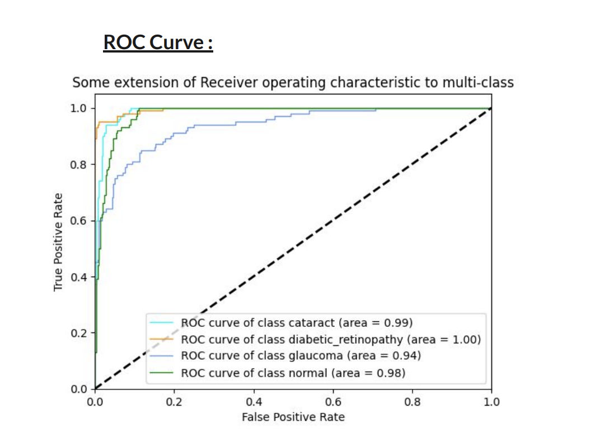

# Eye Disease Detection Model
## Abstract
According to the World Health Organization (WHO), an estimated 253 million people
worldwide are visually impaired, with 36 million of them being blind, predominantly due to eye
diseases. In the pursuit of early diagnosis and intervention for eye diseases, we present an
advanced eye disease detection system harnessing the power of the ResNet (Residual Networks)
architecture.
Our research focuses on accurate, efficient, and accessible detection of eye diseases,
addressing a critical global health concern. The system developed promises to aid eye disease
diagnostics, particularly benefiting low-income and middle-income countries with limited
healthcare resources and high healthcare costs. We also emphasise its role as a preliminary
diagnostic tool.
## Methodology Overview
We explored multiple models, including Inception v3, ResNet, and EfficientNet, and found that
ResNet-50 outperformed the others, which led us to select it as our final model.
## Data Preprocessing and Model Architecture
1. Data Source: [Kaggle Dataset Link](https://www.kaggle.com/datasets/gunavenkatdoddi/eye-diseases-classification)
2. Eye Diseases Detected: Cataract, Glaucoma, Diabetic Retinopathy
3. Split Ratio : 80% Training, 10% Testing, 10% Validation
4. Preprocessing:
	- Resizing Images to 224x224 Pixels ( As per Resnet requirements)
	- Normalization using Mean and Standard Deviation of the Dataset
	- De-noising with ldm-super-resolution-4x-openimages
5. Transfer Learning with Resnet-50, with additional custom layers to enhance its performance.

## Results & Performance Metrics
| Performance Metric | Training Data | Validation Data | Test Data |
|--------------------|---------------|-----------------|-----------|
| Accuracy           | 0.92899       | 0.8975          | 0.8825    |
| Precision          | 0.93245       | 0.89370         | 0.88347   |
| Recall             | 0.92899       | 0.8975          | 0.8825    |
| F1-Score           | 0.92783       | 0.89422         | 0.88218   |

## Visualisations

## Eye Disease Image Analysis
Original Image Vs Normalised Vs Grad-CAM

## Conclusions

The ResNet-50 architecture was chosen and fine-tuned to achieve promising results. Below are the key findings and takeaways from our work.

- **Model Performance**: The trained model demonstrated competitive performance in classifying eye diseases, achieving a high accuracy rate on the test dataset.
- **Streamlit Application**: Model was successfully deployed using a user-friendly Streamlit web application.

**Takeaways**:
- High-quality fundus images are needed to accurately detect if eye diseases like cataracts and glaucoma are present.
- **Deployment**: Denoising the fundus images helps to improve the prediction score.

 

